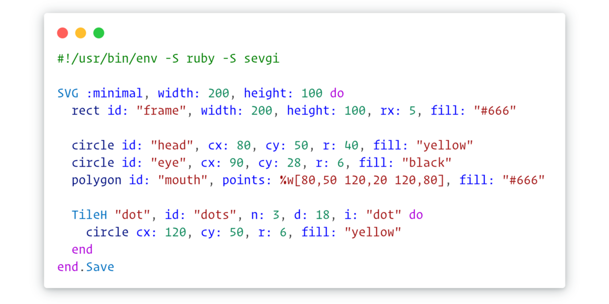

# SEVGI

**SEVGI** is a toolkit for creating SVG content programmatically with Ruby as demonstrated below[^1]. You can use it to
create pixel-perfect graphics without using a vector graphics editor in certain scenarios. Thanks to a mixin based
design, you can easily add custom features and use a rich set of methods, especially for tiling, hatching and various
geometric operations.

### Roadmap

> [!WARNING]
> The project is currently in pre-alpha stage. So many things might not work and many things can change.

Alpha stage

- [ ] Stabilize API.
- [ ] Complete unit tests for all critical code paths.
- [ ] Populate examples while adding integration tests.
- [ ] Write entry-level user documentation.

Beta stage

- [ ] Complete Geometry library.
- [ ] Complete user documentation.
- [ ] Start documenting API.

[^1]: Inspired by [Victor](https://github.com/DannyBen/victor), which might be a better choice for those seeking
      something simpler. Please note that a fair amount of the examples used for demonstration purposes come from this
      project (thanks to the author).
