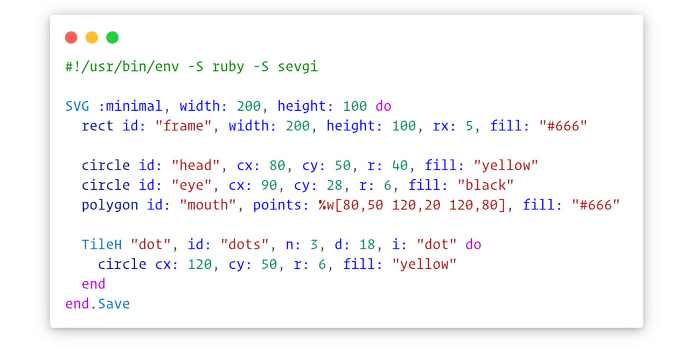

# Sevgi

Inspired by [Victor](https://github.com/DannyBen/victor), which might be a better choice for those seeking something
simpler. Please note that a fair amount of the examples used for demonstration purposes come from this project (thanks
to the author).

### Roadmap
